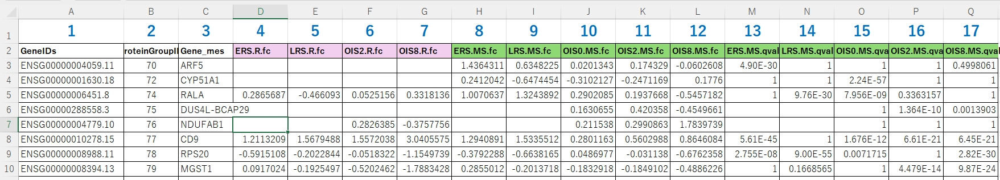
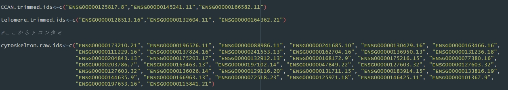
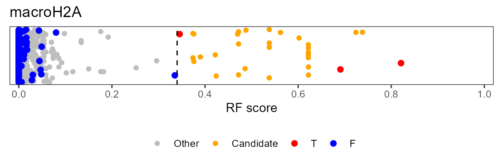

# nanoRFL (nanoRF light)

<!-- badges: start -->
<!-- badges: end -->

nanoRFLは、nanoRF ( https://github.com/EarnshawLab/nanoRF )を簡単に使うためのwrapper packageです。

Montaño-Gutierrez, L. F., Ohta, S., Kustatscher, G., Earnshaw, W. C. & Rappsilber, J. Nano Random Forests to mine protein complexes and their relationships in quantitative proteomics data. Mol Biol Cell 28, 673–680 (2017).


## Installation
githubからファイルをダウンロードする必要はありません。RstudioのConsoleで以下のコマンドをタイプすることで必要なpackageがインストールされます。一度、インストールしたら、次からは実行する必要はありません。

``` r
install.packages("devtools")
install.packages("remotes")
remotes::install_github("rafysta/nanoRFL")
```

## 解析の例
### ライブラリーの読み込み
``` r
library(nanoRFL)
```

### データの読み込み
``` r
FILE_Proteomics_data <- "Proteomics_RNAseq_data_for_nanoRF.xlsx"
rf <- loadProteomicsData(rf, file = FILE_Proteomics_data, column.ratio = c(8:12), column.target = c(8, 9, 11, 12))
```
入力データは、Excel sheet (xlsxの拡張子)か、Text file (txtの拡張子)のどちらかで準備してください。ファイルの拡張子で判断して内容を読み込みます。ファイルはfull pathで指定してください。以下が、ファイルの例です。

column.ratioは、入力データのうち、Random Forestの解析に用いるカラムのindexを指定してください。上のファイルの例だと、8~12番目のカラムを解析に用いるので、`column.ratio = c(8:12)`と指定しています。入力データのうち、column.targetで指定した条件の中で２つ以上の検体でNA(未定義値）でないIDのみを解析のターゲットとします。上の例では、`column.target = c(8, 9, 11, 12)`記述することで、8, 9, 11, 12のカラムのうち少なくとも２つでNAでないIDを解析に用います。


### Training data setのIDの読み込み
``` r
rf <- loadIDfile(rf, file = "load_training_set_ids20250110.R")
```
Random Forestの解析に用いるTraining data setを指定するためのIDのリストを記載したファイルを読み込みます。このファイルは、`***.raw.ids <- c("id1", "id2", "id3")`という形式でIDを定義したものです。\*\*\*の部分は、任意の名前を指定してください。「.raw.ids」で終わっていない変数は無視されます。必ず、変数はこの形式で定義してください。（"raw"部分も省略しないでください。）
最終的な出力ファイルは、\*\*\*の部分の文字列をファイル名として使用します。以下がファイルの例になります。



### 読み込んだIDlistを表示
``` r
checkIDcondition(rf)
```
`loadIDfile`で読み込んだすべての変数を表示します。「All IDs」は、全IDのリスト。Negative varsは、学習に使うControlのIDのリスト。Target varsは、学習に使うtargetのIDのリストです。


### Negative training setのIDを変更
``` r
rf <- setNegative_vars(rf, ids = c("cytoskelton.raw.ids", "mitochondria.raw.ids", "membrane.raw.ids"))
```
既定では、"cytoskelton.raw.ids", "mitochondria.raw.ids", "membrane.raw.ids"がNegative training setとして指定されていますが、他のセットを指定したい場合は、この関数を使って指定してください。


### Target setのIDを変更
``` r
rf <- setTarget_vars(rf, ids = c("HMGA.raw.ids", "macroH2A.raw.ids"))
```
既定では、loadIDfile関数で読み込んだIDリスト(.raw.idsで終わるIDリスト）のうち、Negative training setに用いるIDを除いたものすべてが該当しますが、変更したい場合は、この関数で指定してください。


### 変更後のIDlistを確認
``` r
checkIDcondition(rf)
```
IDのリストを変更したら、再度、この関数を実行して確認してください。


### run nanoRF
``` r
rf <- runRF(rf)
```
originalのnanoRFを実行します。

### output table as text file
``` r
outputTable(rf, file = "RF_score_result.txt")
```
解析結果を出力します。引数として、出力するファイルのFull pathを記載します。


### output cut off value
``` r
outputCutOff(rf, file = "RF_score_cutoff.txt")
```
Random Forest解析によって導出された閾値を出力します。引数として出力するファイルのFull pathを記載します。


### 予測結果のプロット
``` r
plotPrediction(rf, output_dir = "out/2025-01-24_test/img/")
```
各IDごとに、解析結果を散布図でプロットします。`oputput_dir`で指定したフォルダ以下に、pngとpdfファイル（両方とも同じ内容）を出力します。ファイル名は、IDリストの名前を用います。例えば、「hoge.raw.ids」というIDであった場合、hoge.pdf, hoge.pngの２種類のファイルを出力します。以下は出力結果の例。

赤色(T)は、Training setに用いたIDのスコア。青色(F)は、Negative trainingに用いたIDのスコア。オレンジ色(Candidate)は、閾値以上であるID。灰色(Other)は、閾値よりも低いID。


### nanoRF objectの保存と読み込み
解析に利用したすべての情報、および、解析結果は、"rf"に保存されているので、これを保存・読み取りすることで、以前の解析を再開することができます。

``` r
# rf objectの保存
saveRDS(rf, file = "/path/to/output/file.rds")

# rf objectの読み込み
rf <- readRDS(file = "/path/to/output/file.rds")
```
